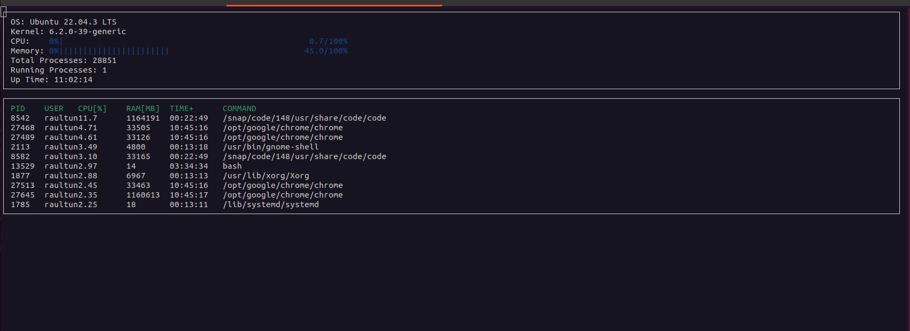

# CppND-System-Monitor

System Monitor Project in the C++ OOP.

## ncurses
[ncurses](https://www.gnu.org/software/ncurses/) is a library that facilitates text-based graphical output in the terminal. This project relies on ncurses for display output.

## Make
This project uses [Make](https://www.gnu.org/software/make/). The Makefile has four targets:
* `build` compiles the source code and generates an executable
* `format` applies [ClangFormat](https://clang.llvm.org/docs/ClangFormat.html) to style the source code
* `debug` compiles the source code and generates an executable, including debugging symbols
* `clean` deletes the `build/` directory, including all of the build artifacts


## Run the project
1. Install `ncurses` package
```
sudo apt install libncurses5-dev libncursesw5-dev
```

2. Build the project: `make build`

3. Run the resulting executable: `./build/monitor`


